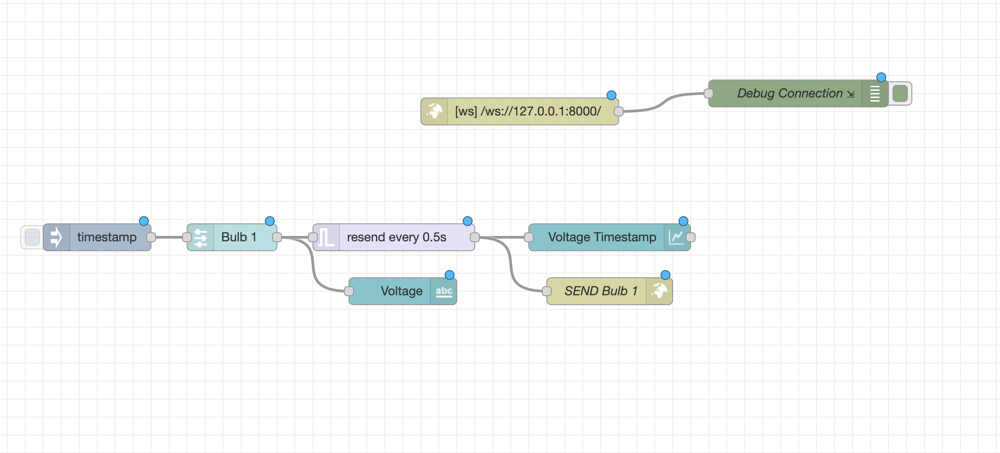
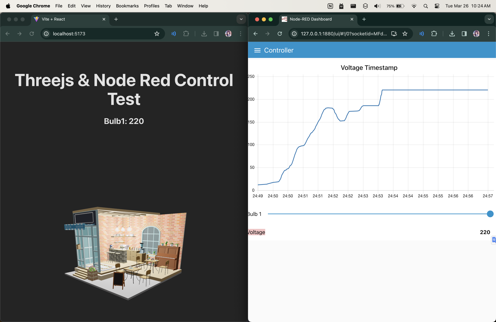

# Smart Building App Documentation

The Smart Building App is a web application that combines Node-RED, React, and Three.js to create an interactive 3D building visualization and control system. The app allows users to monitor the building's lights and voltage usage through a user-friendly interface.

## Architecture

The application follows a client-server architecture, with the following components:

1. **Client-side**:

   - **React**: The front-end framework responsible for rendering the user interface and displaying the 3D building model.
   - **Three.js**: A 3D graphics library used to render the 3D building model and visualize the state of the lights.

2. **Server-side**:

   - **Node-RED**: A flow-based programming tool used for wiring together hardware devices, APIs, and online services. In this application, Node-RED is responsible for controlling the building's lights and monitoring the voltage usage.

3. **WebSocket**: A full-duplex communication protocol that enables real-time communication between the client and the server. It is used to establish a persistent connection between React and Node-RED, allowing for seamless data exchange.

## Data Flow

The data flow in the Smart Building App follows this sequence:

1. Node-RED controls the building's lights and monitors the voltage usage.
2. Node-RED sends the updated data to React through the WebSocket connection.
3. React receives the updated data and updates the 3D building model in Three.js to reflect the current state of the lights and display the voltage usage information.

## Installation and Setup

To run the Smart Building App locally, follow these steps:

1. Install Node-RED by following the official installation guide: https://nodered.org/docs/getting-started/

2. Import the Node-RED control flow from the project repository:

   - In the Node-RED interface, go to the menu bar and select "Import" > "Import nodes" to import the control flow.
   - Import the controller flow located in `./node-red/controllerFlow.json`

3. Clone the repository from the provided source code location.

4. Set up the React application:

   - Navigate to the React project directory: `cd smart-building-app`
   - Install the required dependencies: `npm install`
   - Start the development server: `npm run dev`

5. Configure the WebSocket connection settings in both the React and Node-RED components to ensure proper communication.

6. Start the Node-RED server.

7. Access the application through the provided URL or localhost address.

## Usage

Once the Smart Building App is running, the 3D building model in Three.js will update in real-time to reflect the changes in the building's lights and display the voltage usage information.

## License

The Smart Building App is released under the [MIT License](https://opensource.org/licenses/MIT). See the LICENSE file for more details.
